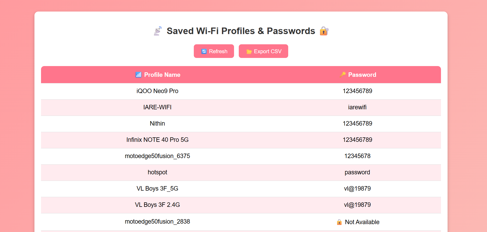

📡 Wi-Fi Key Viewer 🔐

A simple Python + Flask web application that retrieves saved Wi-Fi profiles and passwords from your system and displays them in a user-friendly web interface.  
You can also **export all Wi-Fi credentials as a CSV file**.

🚀 Features
- Fetches saved Wi-Fi profiles using `netsh` (Windows command).
- Displays Wi-Fi profile names along with their passwords.
- Shows 🔒 when password is not available.
- Clean and responsive UI with gradient styling.
- **Export Wi-Fi credentials as CSV** with one click.
- Built with **Python, Flask, HTML, CSS**.
  
📂 Project Structure

📁 wifi-key-viewer

│── app.py           # Flask backend (fetches Wi-Fi profiles & passwords)

│── templates/
│   └── index.html   # Frontend HTML (renders data dynamically)

│── static/
│   └── style.css    # Styling for the UI

⚙️ Requirements
- Python 3.x  
- Flask (`pip install flask`)  
- Windows OS (uses `netsh` command to retrieve Wi-Fi details)

▶️ Usage
1. Clone this repository:
   ```bash
   git clone https://github.com/your-username/wifi-key-viewer.git
   cd wifi-key-viewer
2. Install dependencies:
   ```bash
   pip install flask
   ```
3. Run the Flask app:
   ```bash
   python app.py
   ```
4. Open your browser and go to:
   ```
   http://127.0.0.1:5000/
   ```
📸 Screenshots

**Main Dashboard**


⚠️ Disclaimer
This project is intended for **educational purposes only**.
It retrieves Wi-Fi credentials saved **on your own system**. Do not use it for unauthorized access.


